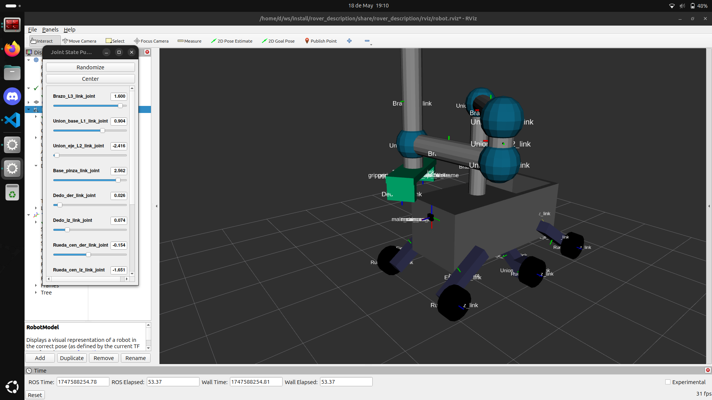
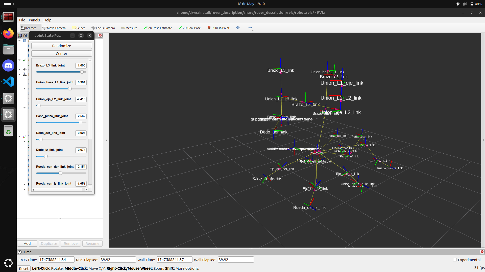
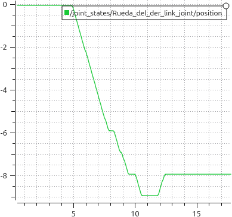
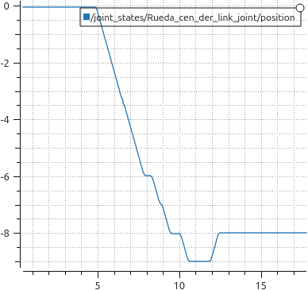
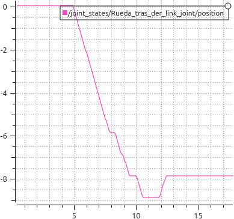
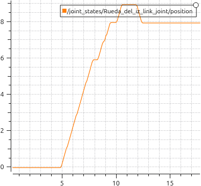
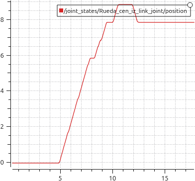
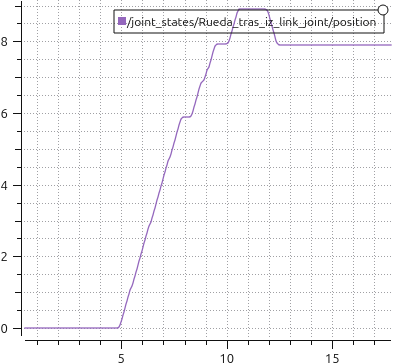
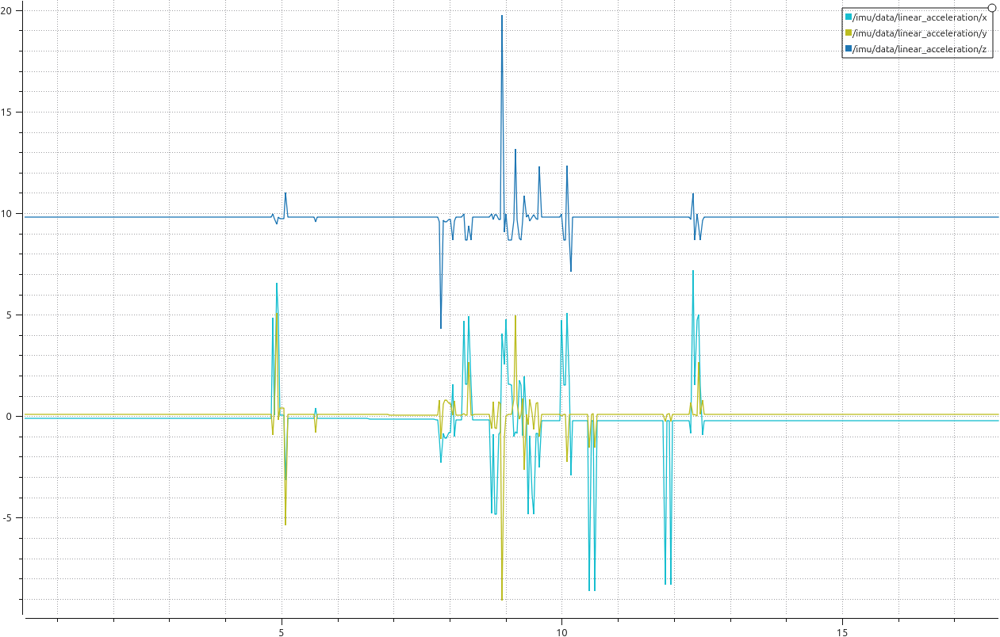

# Práctica 3: Modelado y Simulación de Robots

## Parte A

Imagen de las transformadas del robot  
👉 [Ver transformadas en PDF](data/rover_frames.pdf)  

Imagen del modelo del robot:  

Imagen de las `tf` del robot:  

---

## Parte B

### Posición de las ruedas
Se puede ver que las ruedas derechas primero están en reposo. Tras esto empiezan a rotar en sentido negativo, con pequeños momentos de pausa dado que estaba colocando el robot y no quería pasarme demasiado. Al final se observa que retrocede un poco dado que había dejado el cubo algo atrás.

| **Rueda delantera derecha** |  **Rueda central derecha** | **Rueda trasera derecha** |
| :---: | :---: | :---: |
|  |  |  |

Las ruedas izquierdas siguen el mismo patrón, pero dado que su eje Z apunta en la dirección opuesta, al moverse el signo está invertido con respecto a las ruedas derechas.

| **Rueda delantera izquierda**  |  **Rueda central izquierda**   | **Rueda trasera izquierda**  |
| :---: | :---: | :---: |
|  |  |  |

### Aceleración de las ruedas

En la gráfica se pueden observar las aceleraciones que sufre la IMU a lo largo del recorrido.

El movimiento del robot fue simplemente avanzar en el eje x, que tiene la misma dirección tanto en base_footprint como en la `tf` de la IMU, por lo que son normales esas oscilaciones en el eje, tanto en positivo como en negativo ya que el movimiento no ha sido fluido ya que estaba intentando colocarlo en una posición óptima para agarrar la caja.

La línea que representa al eje Z aparece a mayor altura, debido a la fuerza de la gravedad, pero a parte de eso lo único destacable tanto de este eje como del Y son las oscilaciones que se muestran. Dado que ho ha habido un movimiento expreso en ninguno de los dos ejes asumo que se deben a pequeños errores, como que el robot no se mueva exactamente sobre el eje X, o perturvaciones que pueden haberse debido a movimientos involuntarios en el brazo al realizar la translación.

**Fuerzas detectadas por la IMU**  

### Coste del mecanismo
No puedo añadir una imagen del robot cogiendo la caja o de la gráfica que muestre el gasto pracial en el tiempo dado que no he logrado que el robot ejecute las trayectorias una vez planificadas.

### Rosbag del proceso
[Rosbag de la ejecución de la práctica](https://urjc-my.sharepoint.com/:f:/g/personal/d_lopezm_2022_alumnos_urjc_es/ErMHlDa3HJNNtZf15pczcjMBOtxUywlsjJ3Jw8LkqS-MvA?e=a9YT0R)
